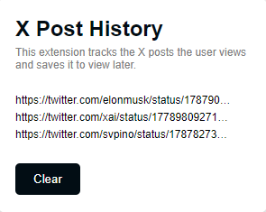

# X.com (formerly X) Post Tracker Chrome Extension

## Overview

The X Post Tracker is a Chrome extension designed to track and save X posts that a user views. This extension currently captures URLs of X posts and displays them in a popup. The project is a work in progress, and future updates will include integration with the X API to fetch and display detailed post information, such as user profiles, post content, and more.

## Features

- **URL Tracking:** Automatically saves the URLs of X posts that the user visits.
- **Popup Display:** Shows a list of saved X post URLs in a popup.
- **Clear List:** Allows users to clear the saved list of X post URLs.

## Planned Features

- **API Integration:** Fetch detailed post information using the X API.
- **Enhanced UI:** Improve the user interface to display post details in a more visually appealing format.

## Installation

To install this extension:

1. Download the repository and unzip it.
2. Open Chrome and navigate to `chrome://extensions/`.
3. Enable Developer Mode by toggling the switch at the top-right.
4. Click the "Load unpacked" button and select the extension directory.

## Usage

After installation, navigate to X and start browsing posts. The URLs of the posts you visit will be automatically saved and can be viewed by clicking the extension icon in the toolbar.
